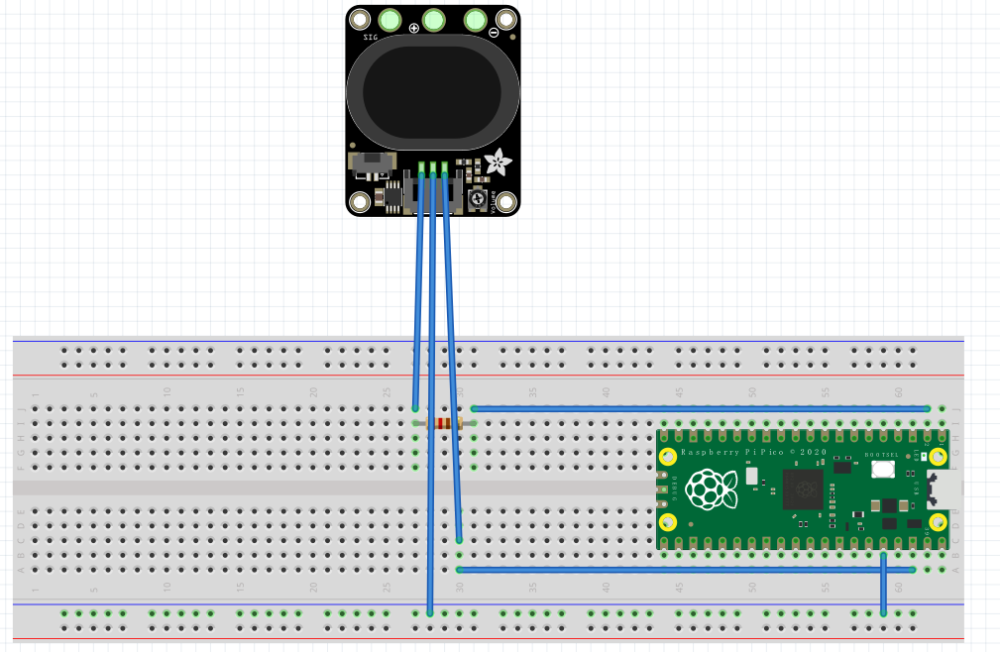
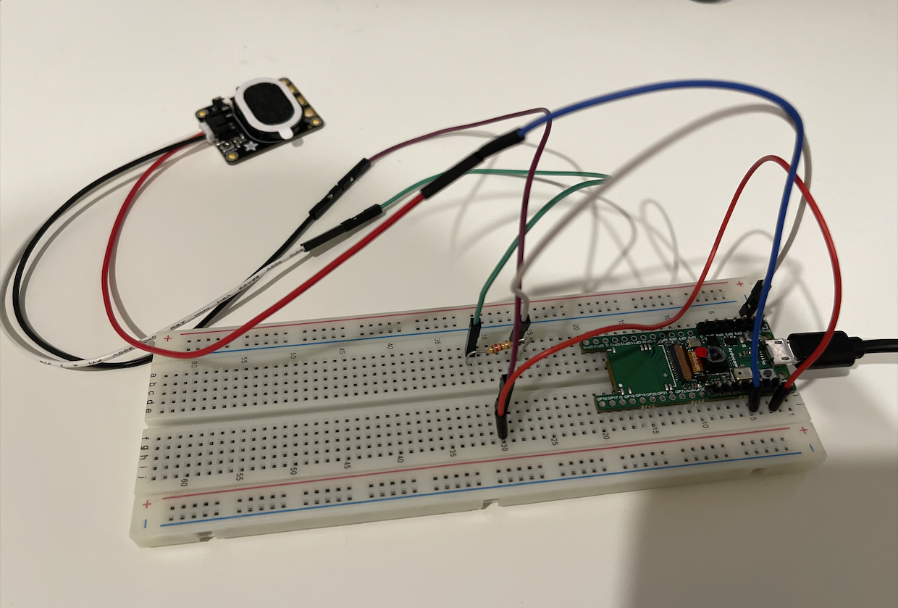

# ese519_final_project_midpoint_check
> Midpoint check for group Strawberry PI 🍑
>
> Team members: Haoze Wu, Xuanbiao Zhu, Ze Li

## 1. Code 
### Goal
1. Our primary goal is to implement a music instrument using RP2040, with extra functionality including recording, replaying, and playing predefined music. 
2. Our further goal is to combine RP2040 with LCD display, which shows music notes dynamically. 

### Done
1. We have finished the free play mode and predefined music mode. 
### In-progress
1. We are working with recording and replaying. 

## 2. Media 
### Material(right now)
1. Pico4ML, with RP2040 as the microcontroller. 
2. Adafruit STEMMA Speaker - Plug and Play Audio Amplifier.

## Design
### Diagram

### Connection

## Demo
Here is our demo:

